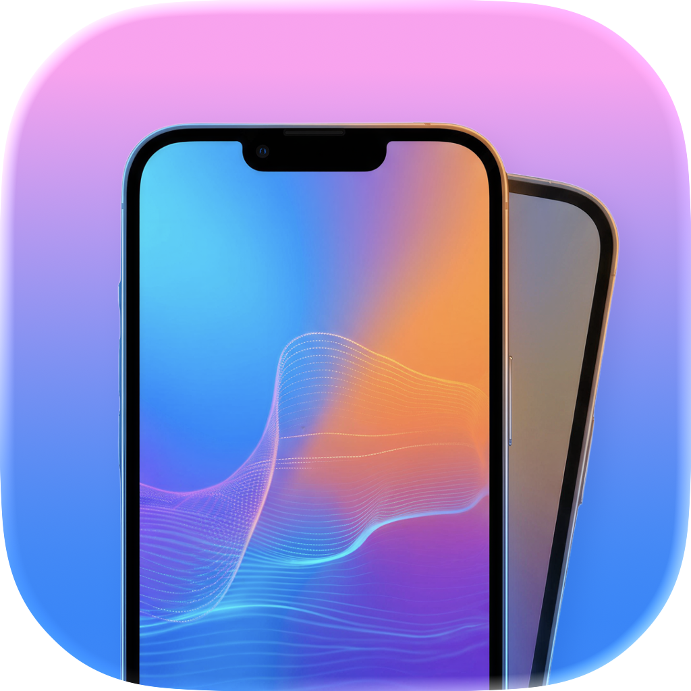
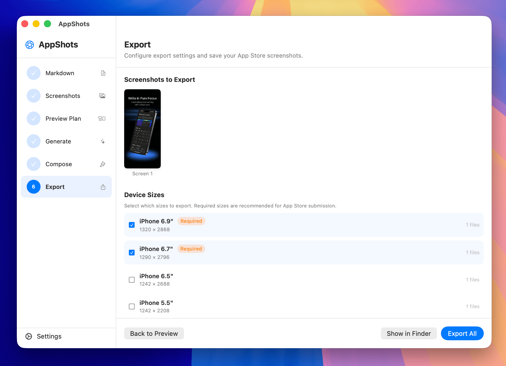
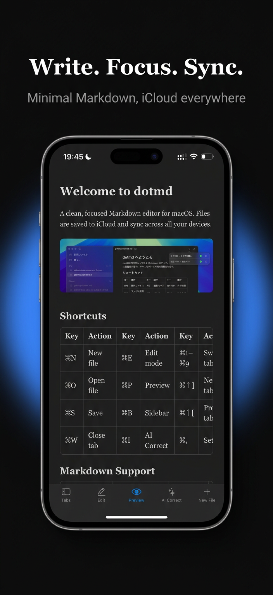

<p align="center">
  
</p>

# AppShots

Drop in screenshots + a Markdown description, get professional App Store screenshots powered by AI. Native macOS app.



## What It Does

AppShots takes your raw app screenshots and a structured Markdown file describing your app, then automatically generates polished App Store marketing screenshots — complete with AI-composed device mockups, headlines, and premium backgrounds.

## Quick Start

1. **Prepare Markdown** — Write a structured description of your app (or use the built-in "Copy Prompt" to have any LLM generate one for you)
2. **Upload Screenshots** — Drag & drop 3-6 raw screenshots from Finder or paste from Simulator (Cmd+V)
3. **Review Plan** — An LLM analyzes your Markdown + screenshots and proposes headlines, layout modifiers, and creative image prompts
4. **Generate** — Screenshots are sent to Gemini along with the LLM-authored prompts. Gemini composes the full App Store screenshot in one pass
5. **Export** — Batch export in multiple device sizes as PNG or JPEG, ready for App Store Connect

### Generated Result

| iPhone 6.9" | iPad 13" |
|---|---|
|  |  |

## Requirements

- macOS 14 (Sonoma) or later
- An OpenAI-compatible LLM API endpoint (for plan generation)
- A Gemini API endpoint (for image generation)

## Build

```bash
swift build
```

Or open `Package.swift` in Xcode.

## Configuration

Open **Settings** (Cmd+,) to configure:
- **LLM API**: Base URL, API key, and model name (OpenAI-compatible)
- **Gemini API**: Base URL, API key, and model name

## How It Works

1. **LLM Plan** — The LLM reads your app description + screenshots and outputs a JSON plan: headlines, colors, layout modifiers (`tilt`, `position`, `full_bleed`), and a creative `image_prompt` for each screen
2. **Gemini Composition** — Each screenshot is sent to Gemini with its `image_prompt`. Gemini composes the full image: device mockup, text, background, perspective — all in one pass
3. **Export** — Final images are exported at App Store-required sizes

The LLM provides context. Gemini provides creativity. No rigid templates.

## Layout Modifiers

Instead of fixed layout templates, each screen gets 3 optional modifiers:

| Modifier | Type | Default | Effect |
|---|---|---|---|
| `tilt` | Bool | false | Rotate device ~8 degrees |
| `position` | String | "center" | "center" / "left" / "right" |
| `full_bleed` | Bool | false | No device frame, screenshot fills canvas |

Default (no modifiers) = big centered device at 80% canvas width.

## Tech Stack

- **SwiftUI** — UI framework
- **Core Graphics / Core Text** — Fallback image composition and text rendering
- **swift-markdown** (Apple) — Markdown parsing to AST
- **URLSession + async/await** — All network calls
- **Zero third-party dependencies** (except swift-markdown)

## Supported Export Sizes

| Device | Pixels | Default |
|---|---|---|
| iPhone 6.9" | 1320 x 2868 | Selected |
| iPhone 6.7" | 1290 x 2796 | Selected |
| iPhone 6.5" | 1242 x 2688 | - |
| iPhone 5.5" | 1242 x 2208 | - |
| iPad 13" | 2048 x 2732 | - |

## Project Structure

See [docs/workflow.md](docs/workflow.md) for the full pipeline architecture and data flow.
